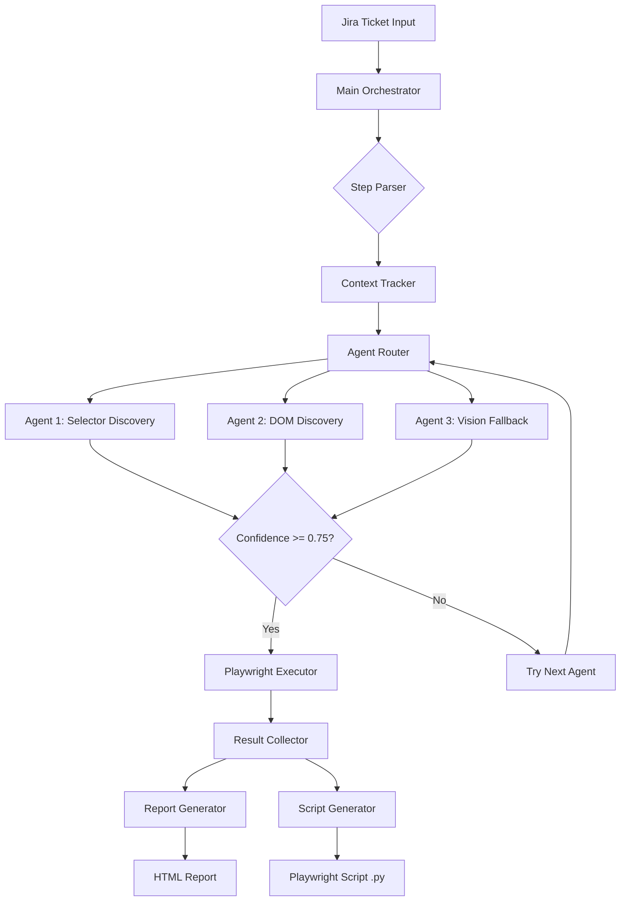
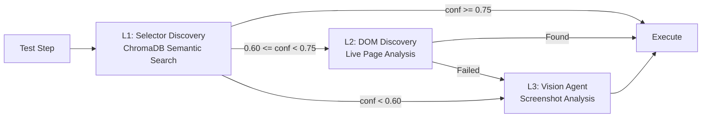
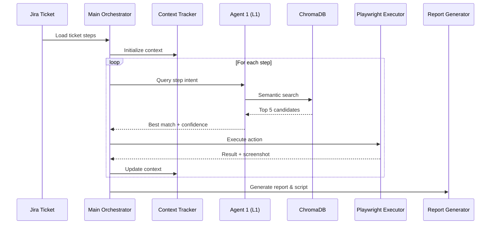
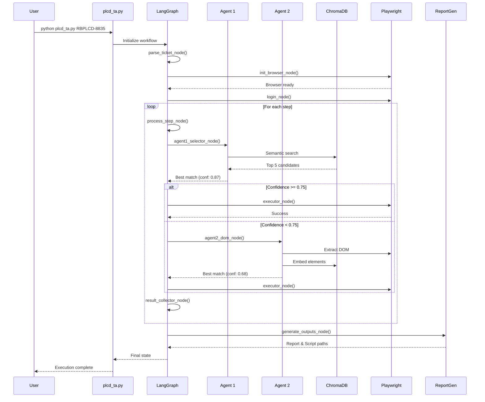

# PLCD Testing Assistant - Technical Specification
**Version:** 2.0  
**Date:** 2025-11-17  
**For:** Development Team (GitHub Copilot + VS Code)  
**Language:** Python 3.12+  
**Framework:** LangChain + LangGraph

---

## Table of Contents

1. [System Architecture Overview](#1-system-architecture-overview)
2. [Technology Stack & Dependencies](#2-technology-stack--dependencies)
3. [Database Schemas](#3-database-schemas)
4. [Agent Implementation Details](#4-agent-implementation-details)
5. [LangGraph Workflow Architecture](#5-langgraph-workflow-architecture)
6. [Azure OpenAI Integration](#6-azure-openai-integration)
7. [ChromaDB Vector Database Setup](#7-chromadb-vector-database-setup)
8. [Code Templates & Class Structures](#8-code-templates--class-structures)
9. [Execution Flow & State Management](#9-execution-flow--state-management)
10. [Error Handling & Retry Logic](#10-error-handling--retry-logic)
11. [Generated Script Format](#11-generated-script-format)
12. [Testing & Validation](#12-testing--validation)

---

## 1. System Architecture Overview

### 1.1 High-Level Architecture



### 1.2 Three-Tier Agent System



### 1.3 Data Flow



---

## 2. Technology Stack & Dependencies

### 2.1 Core Dependencies

```python
# requirements.txt structure (detailed version in separate file)

# LLM Framework
langchain>=0.1.0
langgraph>=0.0.40
langchain-openai>=0.0.5

# Vector Database
chromadb>=0.4.22

# Azure OpenAI
openai>=1.12.0

# Browser Automation
playwright>=1.40.0

# Configuration & Data
pyyaml>=6.0
python-dotenv>=1.0.0

# Utilities
jinja2>=3.1.2
pathlib>=1.0.1
typing-extensions>=4.9.0
```

### 2.2 Azure OpenAI Models

| Purpose | Model Name | Deployment Name | Context Window |
|---------|-----------|----------------|----------------|
| Chat LLM | GPT-4o | `gpt-4o` | 128K tokens |
| Embeddings | text-embedding-3-small | `text-embedding-3-small` | 8K tokens |
| Vision | GPT-4o (vision-capable) | `gpt-4o` | 128K tokens |

---

## 3. Database Schemas

### 3.1 SQLite Database Schema

```sql
-- Project Configuration Database: project_config.db

CREATE TABLE projects (
    project_id TEXT PRIMARY KEY,
    project_name TEXT NOT NULL,
    web_url TEXT NOT NULL,
    browser TEXT DEFAULT 'edge',
    created_at TIMESTAMP DEFAULT CURRENT_TIMESTAMP,
    updated_at TIMESTAMP DEFAULT CURRENT_TIMESTAMP
);

CREATE TABLE login_credentials (
    id INTEGER PRIMARY KEY AUTOINCREMENT,
    project_id TEXT NOT NULL,
    username TEXT NOT NULL,
    password TEXT NOT NULL,  -- Encrypted with bcrypt
    FOREIGN KEY (project_id) REFERENCES projects(project_id)
);

CREATE TABLE agent_memory (
    id INTEGER PRIMARY KEY AUTOINCREMENT,
    project_id TEXT NOT NULL,
    step_text TEXT NOT NULL,
    selector_used TEXT NOT NULL,
    confidence REAL NOT NULL,
    agent_used TEXT NOT NULL,  -- 'L1', 'L2', 'L3'
    module TEXT,
    success BOOLEAN NOT NULL,
    timestamp TIMESTAMP DEFAULT CURRENT_TIMESTAMP,
    FOREIGN KEY (project_id) REFERENCES projects(project_id)
);

CREATE TABLE feedback_learning (
    id INTEGER PRIMARY KEY AUTOINCREMENT,
    project_id TEXT NOT NULL,
    step_text TEXT NOT NULL,
    selector_id TEXT NOT NULL,
    feedback_type TEXT NOT NULL,  -- 'success', 'failure', 'manual_correction'
    correction TEXT,
    timestamp TIMESTAMP DEFAULT CURRENT_TIMESTAMP,
    FOREIGN KEY (project_id) REFERENCES projects(project_id)
);

CREATE TABLE execution_history (
    id INTEGER PRIMARY KEY AUTOINCREMENT,
    ticket_id TEXT NOT NULL,
    project_id TEXT NOT NULL,
    total_steps INTEGER NOT NULL,
    passed_steps INTEGER NOT NULL,
    failed_steps INTEGER NOT NULL,
    execution_time REAL NOT NULL,
    report_path TEXT,
    script_path TEXT,
    video_path TEXT,
    timestamp TIMESTAMP DEFAULT CURRENT_TIMESTAMP,
    FOREIGN KEY (project_id) REFERENCES projects(project_id)
);
```

### 3.2 ChromaDB Collection Structures

```python
# Collection 1: selectors_base_collection
{
    "ids": ["selector_0001", "selector_0002", ...],
    "embeddings": [[0.123, 0.456, ...], [0.789, 0.012, ...], ...],
    "metadatas": [
        {
            "id": "selector_0001",
            "attr": "data-SaveBtn",
            "value": "AddBtn",
            "module": "AddExisting",
            "elementType": "button",
            "label": "Save button for adding items",
            "context": "save,button,add",
            "priority": 25,
            "full_selector": "[data-SaveBtn='AddBtn']"
        },
        ...
    ],
    "documents": [
        "data-SaveBtn_AddBtn AddExisting button Save button for adding items save button add",
        ...
    ]
}

# Collection 2: runtime_learned_collection
{
    "ids": ["learned_0001", "learned_0002", ...],
    "embeddings": [[...], [...], ...],
    "metadatas": [
        {
            "id": "learned_0001",
            "attr": "data-custom-btn",
            "value": "ActionBtn",
            "module": "Teststep",
            "elementType": "button",
            "label": "Learned from DOM discovery",
            "context": "action,click",
            "priority": 60,
            "learned_from": "L2",
            "verified_count": 3,
            "last_used": "2025-11-17T10:23:45"
        },
        ...
    ],
    "documents": [...]
}
```

---

## 4. Agent Implementation Details

### 4.1 Agent 1: Selector Discovery (L1)

**Purpose:** Semantic search in ChromaDB for best matching selector

**Input:**
- `step_text`: Test step description
- `current_module`: Current UI module context
- `step_embedding`: Pre-computed embedding vector

**Output:**
```python
{
    "selector_result": {
        "selector": "[data-SaveBtn='AddBtn']",
        "confidence": 0.87,
        "agent_used": "L1",
        "metadata": {
            "id": "selector_0057",
            "module": "Teststep",
            "priority": 25,
            "distance": 0.13
        }
    },
    "candidates": [
        {"selector": "[data-SaveBtn='AddBtn']", "confidence": 0.87, ...},
        {"selector": "[data-cell='save']", "confidence": 0.76, ...},
        {"selector": "[data-AddBtn='btn']", "confidence": 0.42, ...}
    ]
}
```

**Algorithm:**

```python
def selector_discovery_agent(state: TestState, config: dict) -> dict:
    """
    Agent 1: Semantic selector discovery from ChromaDB
    
    Steps:
    1. Generate step embedding using Azure OpenAI
    2. Apply module filters (current_module + common_modules)
    3. Query ChromaDB with filters
    4. Calculate composite confidence scores
    5. Return top candidate if >= threshold
    """
    
    # Step 1: Embed the test step
    step_embedding = generate_embedding(
        text=state["step_text"],
        client=azure_client,
        model=config["azure_openai"]["models"]["embedding"]
    )
    
    # Step 2: Build module filter
    module_filter = [state["current_module"]] + config["modules"]["common_modules"]
    
    # Step 3: Query ChromaDB
    results = collection.query(
        query_embeddings=[step_embedding],
        n_results=config["agent1_selector_discovery"]["retrieval"]["n_results"],
        where={"module": {"$in": module_filter}}
    )
    
    # Step 4: Calculate confidence scores
    candidates = []
    for i, distance in enumerate(results["distances"][0]):
        similarity = 1 - distance  # Convert distance to similarity
        
        # Apply scoring weights
        module_match = 1.0 if results["metadatas"][0][i]["module"] == state["current_module"] else 0.5
        priority_score = results["metadatas"][0][i].get("priority", 50) / 100
        
        # Composite confidence
        confidence = (
            similarity * config["agent1_selector_discovery"]["scoring"]["semantic_similarity_weight"] +
            module_match * config["agent1_selector_discovery"]["scoring"]["module_match_weight"] +
            priority_score * config["agent1_selector_discovery"]["scoring"]["priority_weight"]
        )
        
        candidates.append({
            "selector": results["metadatas"][0][i]["full_selector"],
            "confidence": confidence,
            "metadata": results["metadatas"][0][i]
        })
    
    # Sort by confidence
    candidates.sort(key=lambda x: x["confidence"], reverse=True)
    
    # Step 5: Return best candidate
    return {
        "selector_result": candidates[0] if candidates else None,
        "candidates": candidates
    }
```

**Configuration Reference:**
```yaml
agent1_selector_discovery:
  retrieval:
    n_results: 5
    confidence_threshold: 0.75
    retry_threshold: 0.70
    max_retries: 3
  scoring:
    semantic_similarity_weight: 0.60
    module_match_weight: 0.20
    priority_weight: 0.15
    context_overlap_weight: 0.05
```

---

### 4.2 Agent 2: DOM Discovery (L2)

**Purpose:** Extract live DOM elements and find best match when L1 confidence is medium (0.60-0.75)

**Activation Condition:**
```python
if 0.60 <= agent1_confidence < 0.75:
    use_agent2()
```

**Algorithm:**

```python
async def dom_discovery_agent(state: TestState, page: Page, config: dict) -> dict:
    """
    Agent 2: Live DOM analysis and selector discovery
    
    Steps:
    1. Extract DOM elements with stable attributes
    2. Generate embeddings for each element
    3. Find semantic match with step intent
    4. Validate selector on page
    5. Learn successful selector (add to runtime collection)
    """
    
    # Step 1: Extract DOM elements
    dom_elements = await page.evaluate("""
        () => {
            const elements = [];
            const selectors = document.querySelectorAll(
                'button, input, select, a, [role="button"], [data-testid]'
            );
            
            selectors.forEach((el, idx) => {
                const attrs = {};
                
                // Prioritize data-* attributes
                for (let attr of el.attributes) {
                    if (attr.name.startsWith('data-')) {
                        attrs[attr.name] = attr.value;
                    }
                }
                
                // ARIA attributes
                if (el.getAttribute('aria-label')) attrs['aria-label'] = el.getAttribute('aria-label');
                if (el.getAttribute('role')) attrs['role'] = el.getAttribute('role');
                
                // Other stable attributes
                if (el.id && !el.id.match(/^[0-9]+$/)) attrs['id'] = el.id;
                if (el.name) attrs['name'] = el.name;
                
                elements.push({
                    index: idx,
                    tagName: el.tagName.toLowerCase(),
                    text: el.innerText?.substring(0, 50) || '',
                    attributes: attrs,
                    visible: el.offsetParent !== null
                });
            });
            
            return elements.filter(e => e.visible);
        }
    """)
    
    # Step 2: Generate embeddings for elements
    element_texts = []
    for elem in dom_elements:
        # Create composite text similar to selector embedding strategy
        text = f"{elem['tagName']} {elem['text']} {' '.join(elem['attributes'].values())}"
        element_texts.append(text)
    
    embeddings = await batch_generate_embeddings(
        texts=element_texts,
        client=azure_client,
        model=config["azure_openai"]["models"]["embedding"],
        batch_size=config["azure_openai"]["embedding_config"]["batch_size"]
    )
    
    # Step 3: Find best semantic match
    step_embedding = state["step_embedding"]
    similarities = cosine_similarity(step_embedding, embeddings)
    
    best_match_idx = similarities.argmax()
    best_similarity = similarities[best_match_idx]
    best_element = dom_elements[best_match_idx]
    
    # Step 4: Build selector from best element
    selector = build_stable_selector(best_element)
    
    # Confidence boosting based on attribute quality
    confidence = best_similarity
    if any(attr.startswith('data-') for attr in best_element['attributes']):
        confidence += config["agent2_dom_discovery"]["confidence_boost"]["has_data_attr"]
    if 'aria-label' in best_element['attributes'] or 'role' in best_element['attributes']:
        confidence += config["agent2_dom_discovery"]["confidence_boost"]["has_aria"]
    
    confidence = min(confidence, 1.0)  # Cap at 1.0
    
    # Step 5: Validate selector
    try:
        await page.wait_for_selector(selector, timeout=5000)
        is_valid = True
    except:
        is_valid = False
        confidence *= 0.5  # Penalize invalid selector
    
    # Step 6: Learn if successful and confidence high enough
    if is_valid and confidence >= config["agent2_dom_discovery"]["learning"]["min_confidence_to_learn"]:
        learn_selector_to_runtime_collection(
            selector=selector,
            step_text=state["step_text"],
            module=state["current_module"],
            confidence=confidence
        )
    
    return {
        "selector_result": {
            "selector": selector,
            "confidence": confidence,
            "agent_used": "L2",
            "metadata": {
                "element": best_element,
                "similarity": best_similarity,
                "validated": is_valid
            }
        }
    }


def build_stable_selector(element: dict) -> str:
    """
    Build selector prioritizing stability:
    1. data-* attributes (highest priority)
    2. aria-* attributes
    3. id (if meaningful)
    4. name
    5. class (if specific)
    6. text-based (last resort)
    """
    attrs = element['attributes']
    
    # Priority 1: data-* attributes
    for attr_name, attr_value in attrs.items():
        if attr_name.startswith('data-'):
            return f"[{attr_name}='{attr_value}']"
    
    # Priority 2: aria-label or role
    if 'aria-label' in attrs:
        return f"[aria-label='{attrs['aria-label']}']"
    if 'role' in attrs:
        return f"[role='{attrs['role']}']"
    
    # Priority 3: id (if not purely numeric)
    if 'id' in attrs and not attrs['id'].isdigit():
        return f"#{attrs['id']}"
    
    # Priority 4: name
    if 'name' in attrs:
        return f"[name='{attrs['name']}']"
    
    # Priority 5: text-based (least stable)
    if element.get('text'):
        return f"{element['tagName']}:has-text('{element['text'][:20]}')"
    
    return None
```

**Configuration Reference:**
```yaml
agent2_dom_discovery:
  activation:
    min_confidence_from_l1: 0.60
    max_confidence_from_l1: 0.75
  selector_priority:
    data_attributes: 100
    aria_attributes: 80
    id_attributes: 60
  confidence_boost:
    has_data_attr: 0.15
    has_aria: 0.10
  learning:
    add_to_collection: true
    min_confidence_to_learn: 0.70
```

---

### 4.3 Agent 3: Vision Fallback (L3)

**Purpose:** Use GPT-4o vision to analyze screenshots and suggest selectors when L1 and L2 fail

**Activation Condition:**
```python
if agent1_confidence < 0.60 or agent2_failed:
    use_agent3()
```

**Algorithm:**

```python
async def vision_agent(state: TestState, page: Page, config: dict) -> dict:
    """
    Agent 3: Vision-based selector suggestion
    
    Steps:
    1. Capture current page screenshot
    2. Send to GPT-4o vision with step intent
    3. Get selector suggestions
    4. Validate each suggestion
    5. Return first valid selector
    """
    
    # Step 1: Capture screenshot
    screenshot_path = f"Screenshots/step_{state['step_number']}_vision.png"
    await page.screenshot(path=screenshot_path, full_page=False)
    
    with open(screenshot_path, "rb") as img_file:
        import base64
        image_base64 = base64.b64encode(img_file.read()).decode('utf-8')
    
    # Step 2: Call GPT-4o vision
    vision_prompt = config["agent3_vision"]["vision_prompt"].format(
        step_text=state["step_text"],
        current_module=state["current_module"]
    )
    
    response = azure_client.chat.completions.create(
        model=config["azure_openai"]["models"]["vision"],
        messages=[
            {
                "role": "system",
                "content": config["agent3_vision"]["system_prompt"]
            },
            {
                "role": "user",
                "content": [
                    {"type": "text", "text": vision_prompt},
                    {
                        "type": "image_url",
                        "image_url": {
                            "url": f"data:image/png;base64,{image_base64}"
                        }
                    }
                ]
            }
        ],
        max_tokens=config["agent3_vision"]["vision_api"]["max_tokens"],
        temperature=config["agent3_vision"]["vision_api"]["temperature"]
    )
    
    # Step 3: Parse JSON response
    import json
    result = json.loads(response.choices[0].message.content)
    
    # Step 4: Validate each selector candidate
    for selector in result["selector_candidates"]:
        try:
            await page.wait_for_selector(selector, timeout=5000)
            # Selector is valid
            return {
                "selector_result": {
                    "selector": selector,
                    "confidence": result["confidence"],
                    "agent_used": "L3",
                    "metadata": {
                        "reasoning": result["reasoning"],
                        "all_candidates": result["selector_candidates"]
                    }
                }
            }
        except:
            continue
    
    # All selectors failed
    return {
        "selector_result": None,
        "error": "Vision agent could not find valid selector"
    }
```

**Configuration Reference:**
```yaml
agent3_vision:
  activation:
    max_confidence_from_l1: 0.60
  vision_api:
    model: "gpt-4o"
    max_tokens: 500
    temperature: 0.1
  selector_generation:
    max_attempts: 3
    validation_required: true
```

---

## 5. LangGraph Workflow Architecture

### 5.1 State Schema

```python
from typing import TypedDict, List, Dict, Optional
from typing_extensions import Annotated

class TestState(TypedDict):
    """Complete state for test execution workflow"""
    
    # Ticket Information
    ticket_id: str
    ticket_content: str
    steps: List[str]
    
    # Current Step Execution
    step_number: int
    step_text: str
    step_embedding: Optional[List[float]]
    
    # Module Context
    current_module: str
    previous_steps: List[str]
    module_history: List[str]
    
    # Selector Discovery Results
    selector_result: Optional[Dict]
    candidates: List[Dict]
    agent_used: str  # "L1", "L2", "L3"
    
    # Execution Status
    execution_status: str  # "pending", "in_progress", "success", "failed"
    error_message: Optional[str]
    retry_count: int
    
    # Browser Context
    page_url: str
    page_title: str
    
    # Aggregated Results
    step_results: Annotated[List[Dict], "append"]  # Results accumulate
    overall_status: str  # "PASSED", "FAILED", "PARTIAL"
    
    # Generated Outputs
    report_path: Optional[str]
    script_path: Optional[str]
    video_path: Optional[str]
    
    # Performance Metrics
    execution_start_time: float
    execution_end_time: Optional[float]
    total_api_calls: int
```

### 5.2 LangGraph Workflow Definition

```python
from langgraph.graph import StateGraph, END
from langchain_core.runnables import RunnableConfig

# Define workflow
workflow = StateGraph(TestState)

# Add nodes
workflow.add_node("parse_ticket", parse_ticket_node)
workflow.add_node("init_browser", init_browser_node)
workflow.add_node("login", login_node)
workflow.add_node("process_step", process_step_node)
workflow.add_node("context_tracker", context_tracker_node)
workflow.add_node("agent_router", agent_router_node)
workflow.add_node("agent1_selector", agent1_selector_node)
workflow.add_node("agent2_dom", agent2_dom_node)
workflow.add_node("agent3_vision", agent3_vision_node)
workflow.add_node("playwright_executor", playwright_executor_node)
workflow.add_node("result_collector", result_collector_node)
workflow.add_node("generate_report", generate_report_node)
workflow.add_node("generate_script", generate_script_node)

# Define edges
workflow.set_entry_point("parse_ticket")
workflow.add_edge("parse_ticket", "init_browser")
workflow.add_edge("init_browser", "login")
workflow.add_edge("login", "process_step")
workflow.add_edge("process_step", "context_tracker")
workflow.add_edge("context_tracker", "agent_router")

# Conditional routing based on agent decision
workflow.add_conditional_edges(
    "agent_router",
    route_to_agent,
    {
        "L1": "agent1_selector",
        "L2": "agent2_dom",
        "L3": "agent3_vision"
    }
)

workflow.add_edge("agent1_selector", "playwright_executor")
workflow.add_edge("agent2_dom", "playwright_executor")
workflow.add_edge("agent3_vision", "playwright_executor")
workflow.add_edge("playwright_executor", "result_collector")

# Conditional edge: more steps or finish
workflow.add_conditional_edges(
    "result_collector",
    check_more_steps,
    {
        "continue": "process_step",
        "finish": "generate_report"
    }
)

workflow.add_edge("generate_report", "generate_script")
workflow.add_edge("generate_script", END)

# Compile graph
app = workflow.compile()
```

### 5.3 Node Implementations

```python
def parse_ticket_node(state: TestState, config: RunnableConfig) -> TestState:
    """Parse Jira ticket and extract test steps"""
    ticket_path = f"Jira_Tickets/{state['ticket_id']}.txt"
    with open(ticket_path, 'r', encoding='utf-8') as f:
        content = f.read()
    
    # Extract steps (assuming format: "Step 1: ...", "Step 2: ...")
    import re
    steps = re.findall(r'Step \d+:\s*(.+)', content)
    
    return {
        **state,
        "ticket_content": content,
        "steps": steps,
        "step_number": 0,
        "overall_status": "PASSED"
    }


def route_to_agent(state: TestState) -> str:
    """Decide which agent to use based on L1 confidence"""
    if state.get("selector_result"):
        confidence = state["selector_result"]["confidence"]
        if confidence >= 0.75:
            return "L1"
        elif confidence >= 0.60:
            return "L2"
        else:
            return "L3"
    return "L1"  # Default to L1 first


def check_more_steps(state: TestState) -> str:
    """Check if there are more steps to process"""
    if state["step_number"] < len(state["steps"]):
        return "continue"
    return "finish"


async def playwright_executor_node(state: TestState, config: RunnableConfig) -> TestState:
    """Execute Playwright action based on selector"""
    from playwright.async_api import async_playwright
    
    selector = state["selector_result"]["selector"]
    action_type = detect_action_type(state["step_text"])
    
    try:
        page = state["_page"]  # Page object passed in context
        
        if action_type == "click":
            await page.click(selector)
            await page.wait_for_timeout(config["wait_times"]["after_click"])
        
        elif action_type == "type":
            text_to_type = extract_text_to_type(state["step_text"])
            await page.fill(selector, text_to_type)
            await page.wait_for_timeout(config["wait_times"]["after_type"])
        
        elif action_type == "select":
            option = extract_option_text(state["step_text"])
            await page.select_option(selector, label=option)
            await page.wait_for_timeout(config["wait_times"]["after_dropdown"])
        
        # Capture screenshot
        screenshot_path = f"Screenshots/step_{state['step_number']}_success.png"
        await page.screenshot(path=screenshot_path)
        
        return {
            **state,
            "execution_status": "success",
            "page_url": page.url,
            "page_title": await page.title()
        }
    
    except Exception as e:
        return {
            **state,
            "execution_status": "failed",
            "error_message": str(e)
        }
```

---

## 6. Azure OpenAI Integration

### 6.1 Client Initialization

```python
from openai import AzureOpenAI
import yaml

def init_azure_client(config_path: str = "plcdtestassistant.yaml") -> AzureOpenAI:
    """Initialize Azure OpenAI client from config"""
    with open(config_path, 'r') as f:
        config = yaml.safe_load(f)
    
    return AzureOpenAI(
        api_key=config['azure_openai']['api_key'],
        api_version=config['azure_openai']['api_version'],
        azure_endpoint=config['azure_openai']['endpoint']
    )
```

### 6.2 Embedding Generation

```python
def generate_embedding(
    text: str,
    client: AzureOpenAI,
    model: str = "text-embedding-3-small"
) -> List[float]:
    """
    Generate embedding for a single text
    
    Args:
        text: Input text to embed
        client: Azure OpenAI client
        model: Deployment name for embedding model
    
    Returns:
        List of 1536 floats (embedding vector)
    """
    response = client.embeddings.create(
        input=text,
        model=model
    )
    return response.data[0].embedding


def batch_generate_embeddings(
    texts: List[str],
    client: AzureOpenAI,
    model: str = "text-embedding-3-small",
    batch_size: int = 50
) -> List[List[float]]:
    """
    Generate embeddings in batches for efficiency
    
    Args:
        texts: List of texts to embed
        client: Azure OpenAI client
        model: Deployment name
        batch_size: Number of texts per API call
    
    Returns:
        List of embedding vectors
    """
    all_embeddings = []
    
    for i in range(0, len(texts), batch_size):
        batch = texts[i:i + batch_size]
        response = client.embeddings.create(
            input=batch,
            model=model
        )
        batch_embeddings = [data.embedding for data in response.data]
        all_embeddings.extend(batch_embeddings)
    
    return all_embeddings
```

### 6.3 Chat Completion for Vision

```python
import base64

def call_vision_api(
    image_path: str,
    prompt: str,
    system_prompt: str,
    client: AzureOpenAI,
    model: str = "gpt-4o",
    max_tokens: int = 500
) -> str:
    """
    Call GPT-4o vision API with screenshot
    
    Args:
        image_path: Path to screenshot
        prompt: User prompt with step intent
        system_prompt: System instructions
        client: Azure OpenAI client
        model: Vision model deployment name
        max_tokens: Response length limit
    
    Returns:
        JSON string with selector candidates
    """
    # Encode image to base64
    with open(image_path, "rb") as img_file:
        image_base64 = base64.b64encode(img_file.read()).decode('utf-8')
    
    response = client.chat.completions.create(
        model=model,
        messages=[
            {
                "role": "system",
                "content": system_prompt
            },
            {
                "role": "user",
                "content": [
                    {"type": "text", "text": prompt},
                    {
                        "type": "image_url",
                        "image_url": {
                            "url": f"data:image/png;base64,{image_base64}"
                        }
                    }
                ]
            }
        ],
        max_tokens=max_tokens,
        temperature=0.1
    )
    
    return response.choices[0].message.content
```

---

## 7. ChromaDB Vector Database Setup

### 7.1 Collection Creation

```python
import chromadb
from chromadb.config import Settings

def create_chromadb_client(persist_directory: str = "./data/chromadb") -> chromadb.Client:
    """Create persistent ChromaDB client"""
    return chromadb.Client(
        Settings(
            persist_directory=persist_directory,
            anonymized_telemetry=False
        )
    )


def create_selector_collection(client: chromadb.Client) -> chromadb.Collection:
    """Create or get selectors collection"""
    return client.get_or_create_collection(
        name="selectors_base_collection",
        metadata={"description": "Base selector library with 1340 selectors"}
    )


def create_runtime_collection(client: chromadb.Client) -> chromadb.Collection:
    """Create or get runtime learned collection"""
    return client.get_or_create_collection(
        name="runtime_learned_collection",
        metadata={"description": "Selectors learned from Agent 2 (L2) DOM discovery"}
    )
```

### 7.2 Embedding and Indexing Selectors

```python
import json
from typing import List, Dict

def embed_selectors_to_chromadb(
    json_path: str,
    collection: chromadb.Collection,
    azure_client: AzureOpenAI,
    embedding_model: str,
    batch_size: int = 50
):
    """
    Load selectors from JSON, generate embeddings, and add to ChromaDB
    
    Args:
        json_path: Path to selectors JSON file
        collection: ChromaDB collection
        azure_client: Azure OpenAI client
        embedding_model: Deployment name for embeddings
        batch_size: Batch size for API calls
    """
    # Load selectors
    with open(json_path, 'r', encoding='utf-8') as f:
        data = json.load(f)
    
    selectors = data['selectors']
    
    # Prepare data for embedding
    ids = []
    documents = []
    metadatas = []
    
    for selector in selectors:
        # Build composite text for embedding
        context_str = " ".join(selector.get('context', []))
        doc_text = f"{selector['attr']}_{selector['value']} {selector['module']} {selector.get('elementType', '')} {selector.get('label', '')} {context_str}"
        
        ids.append(selector['id'])
        documents.append(doc_text.strip())
        metadatas.append({
            "id": selector['id'],
            "attr": selector['attr'],
            "value": selector['value'],
            "module": selector['module'],
            "elementType": selector.get('elementType', ''),
            "label": selector.get('label', ''),
            "context": context_str,
            "priority": selector.get('priority', 50),
            "full_selector": f"[{selector['attr']}='{selector['value']}']"
        })
    
    # Generate embeddings in batches
    print(f"Generating embeddings for {len(documents)} selectors...")
    embeddings = batch_generate_embeddings(
        texts=documents,
        client=azure_client,
        model=embedding_model,
        batch_size=batch_size
    )
    
    # Add to ChromaDB in batches
    print("Adding to ChromaDB...")
    for i in range(0, len(ids), batch_size):
        batch_ids = ids[i:i + batch_size]
        batch_docs = documents[i:i + batch_size]
        batch_metas = metadatas[i:i + batch_size]
        batch_embeds = embeddings[i:i + batch_size]
        
        collection.add(
            ids=batch_ids,
            documents=batch_docs,
            metadatas=batch_metas,
            embeddings=batch_embeds
        )
    
    print(f"Successfully embedded {len(ids)} selectors!")
```

### 7.3 Semantic Search with Filters

```python
def semantic_search_selectors(
    query_text: str,
    current_module: str,
    common_modules: List[str],
    collection: chromadb.Collection,
    azure_client: AzureOpenAI,
    embedding_model: str,
    n_results: int = 5
) -> Dict:
    """
    Perform semantic search with module filtering
    
    Args:
        query_text: Test step text
        current_module: Current UI module
        common_modules: Always-included modules (Common, Shared, etc.)
        collection: ChromaDB collection
        azure_client: Azure OpenAI client
        embedding_model: Embedding model name
        n_results: Number of results to return
    
    Returns:
        Dictionary with results and metadata
    """
    # Generate query embedding
    query_embedding = generate_embedding(
        text=query_text,
        client=azure_client,
        model=embedding_model
    )
    
    # Build module filter
    module_filter = [current_module] + common_modules
    
    # Query ChromaDB with filter
    results = collection.query(
        query_embeddings=[query_embedding],
        n_results=n_results,
        where={"module": {"$in": module_filter}}
    )
    
    return {
        "ids": results["ids"][0],
        "distances": results["distances"][0],
        "metadatas": results["metadatas"][0],
        "documents": results["documents"][0]
    }
```

---

## 8. Code Templates & Class Structures

### 8.1 Main Orchestrator Class

```python
# plcd_ta.py

import asyncio
import yaml
from pathlib import Path
from typing import Dict, List
from playwright.async_api import async_playwright, Browser, Page
from langgraph.graph import StateGraph

class PLCDTestingAssistant:
    """Main orchestrator for PLCD test automation"""
    
    def __init__(self, config_path: str = "plcdtestassistant.yaml"):
        self.config = self.load_config(config_path)
        self.azure_client = self.init_azure_client()
        self.chroma_client = self.init_chromadb()
        self.selector_collection = self.get_selector_collection()
        self.runtime_collection = self.get_runtime_collection()
        self.workflow = self.build_workflow()
    
    def load_config(self, config_path: str) -> dict:
        """Load YAML configuration"""
        with open(config_path, 'r') as f:
            return yaml.safe_load(f)
    
    def init_azure_client(self):
        """Initialize Azure OpenAI client"""
        from openai import AzureOpenAI
        return AzureOpenAI(
            api_key=self.config['azure_openai']['api_key'],
            api_version=self.config['azure_openai']['api_version'],
            azure_endpoint=self.config['azure_openai']['endpoint']
        )
    
    def init_chromadb(self):
        """Initialize ChromaDB client"""
        import chromadb
        from chromadb.config import Settings
        return chromadb.Client(
            Settings(
                persist_directory=self.config['vector_database']['persist_directory'],
                anonymized_telemetry=False
            )
        )
    
    def get_selector_collection(self):
        """Get base selector collection"""
        return self.chroma_client.get_or_create_collection(
            name=self.config['vector_database']['collections']['selectors_base']
        )
    
    def get_runtime_collection(self):
        """Get runtime learned collection"""
        return self.chroma_client.get_or_create_collection(
            name=self.config['vector_database']['collections']['runtime_learned']
        )
    
    def build_workflow(self) -> StateGraph:
        """Build LangGraph workflow"""
        from langgraph.graph import StateGraph, END
        
        workflow = StateGraph(TestState)
        
        # Add nodes (implementations in separate modules)
        workflow.add_node("parse_ticket", self.parse_ticket_node)
        workflow.add_node("init_browser", self.init_browser_node)
        workflow.add_node("login", self.login_node)
        workflow.add_node("process_step", self.process_step_node)
        workflow.add_node("agent_router", self.agent_router_node)
        workflow.add_node("agent1_selector", self.agent1_node)
        workflow.add_node("agent2_dom", self.agent2_node)
        workflow.add_node("agent3_vision", self.agent3_node)
        workflow.add_node("executor", self.executor_node)
        workflow.add_node("result_collector", self.result_collector_node)
        workflow.add_node("generate_outputs", self.generate_outputs_node)
        
        # Define edges (simplified)
        workflow.set_entry_point("parse_ticket")
        workflow.add_edge("parse_ticket", "init_browser")
        workflow.add_edge("init_browser", "login")
        workflow.add_edge("login", "process_step")
        workflow.add_edge("process_step", "agent_router")
        
        # Conditional routing
        workflow.add_conditional_edges(
            "agent_router",
            self.route_to_agent,
            {"L1": "agent1_selector", "L2": "agent2_dom", "L3": "agent3_vision"}
        )
        
        workflow.add_edge("agent1_selector", "executor")
        workflow.add_edge("agent2_dom", "executor")
        workflow.add_edge("agent3_vision", "executor")
        workflow.add_edge("executor", "result_collector")
        
        workflow.add_conditional_edges(
            "result_collector",
            self.check_more_steps,
            {"continue": "process_step", "finish": "generate_outputs"}
        )
        
        workflow.add_edge("generate_outputs", END)
        
        return workflow.compile()
    
    async def execute_ticket(self, ticket_id: str) -> Dict:
        """
        Execute full ticket workflow
        
        Args:
            ticket_id: Jira ticket ID (e.g., "RBPLCD-8835")
        
        Returns:
            Execution results dictionary
        """
        initial_state = {
            "ticket_id": ticket_id,
            "step_number": 0,
            "step_results": [],
            "overall_status": "PASSED"
        }
        
        final_state = await self.workflow.ainvoke(initial_state)
        
        return {
            "ticket_id": ticket_id,
            "status": final_state["overall_status"],
            "report_path": final_state.get("report_path"),
            "script_path": final_state.get("script_path"),
            "video_path": final_state.get("video_path")
        }
    
    # Node implementations
    def parse_ticket_node(self, state: TestState) -> TestState:
        """Parse ticket and extract steps"""
        # Implementation here
        pass
    
    async def init_browser_node(self, state: TestState) -> TestState:
        """Initialize Playwright browser"""
        # Implementation here
        pass
    
    # ... other node implementations ...


# Entry point
async def main(ticket_id: str):
    """Main entry point"""
    assistant = PLCDTestingAssistant()
    result = await assistant.execute_ticket(ticket_id)
    print(f"Execution completed: {result['status']}")
    print(f"Report: {result['report_path']}")
    print(f"Script: {result['script_path']}")


if __name__ == "__main__":
    import sys
    ticket_id = sys.argv[1] if len(sys.argv) > 1 else "RBPLCD-8835"
    asyncio.run(main(ticket_id))
```

### 8.2 Context Tracker Class

```python
# utils/context_tracker.py

from typing import List, Optional

class ContextTracker:
    """Track module context across test steps"""
    
    def __init__(self, known_modules: List[str], module_aliases: dict):
        self.known_modules = known_modules
        self.module_aliases = module_aliases
        self.current_module = "Dashboard"  # Default starting module
        self.module_history = []
    
    def detect_module_from_step(self, step_text: str) -> Optional[str]:
        """
        Detect module from step text
        
        Args:
            step_text: Test step description
        
        Returns:
            Detected module name or None
        """
        step_lower = step_text.lower()
        
        # Check for explicit navigation keywords
        navigation_patterns = {
            "navigate to": r"navigate to (\w+)",
            "go to": r"go to (\w+)",
            "open": r"open (\w+)",
            "click on": r"click on (\w+) (menu|tab|link)"
        }
        
        import re
        for pattern_name, pattern in navigation_patterns.items():
            match = re.search(pattern, step_lower)
            if match:
                module_name = match.group(1).capitalize()
                # Check aliases
                if module_name in self.module_aliases:
                    return self.module_aliases[module_name]
                # Check known modules
                if module_name in self.known_modules:
                    return module_name
        
        return None
    
    def update_module(self, new_module: str):
        """Update current module"""
        if new_module != self.current_module:
            self.module_history.append(self.current_module)
            self.current_module = new_module
    
    def get_current_module(self) -> str:
        """Get current module"""
        return self.current_module
    
    def get_module_filter(self, common_modules: List[str]) -> List[str]:
        """
        Get module filter for semantic search
        
        Args:
            common_modules: Always-included modules
        
        Returns:
            List of modules to search
        """
        return [self.current_module] + common_modules
```

### 8.3 Report Generator Class

```python
# utils/report_generator.py

from jinja2 import Template
from pathlib import Path
from datetime import datetime
from typing import List, Dict

class ReportGenerator:
    """Generate HTML reports from execution results"""
    
    REPORT_TEMPLATE = """
<!DOCTYPE html>
<html>
<head>
    <title>Test Report: {{ ticket_id }}</title>
    <style>
        body { font-family: Arial, sans-serif; margin: 20px; }
        h1 { color: #333; }
        .summary { background: #f0f0f0; padding: 15px; border-radius: 5px; }
        .step { border: 1px solid #ddd; margin: 10px 0; padding: 10px; }
        .step.passed { border-left: 5px solid green; }
        .step.failed { border-left: 5px solid red; }
        .confidence { font-weight: bold; }
        .screenshot { max-width: 800px; margin: 10px 0; }
    </style>
</head>
<body>
    <h1>Test Execution Report</h1>
    
    <div class="summary">
        <h2>Summary</h2>
        <p><strong>Ticket ID:</strong> {{ ticket_id }}</p>
        <p><strong>Execution Time:</strong> {{ execution_time }}</p>
        <p><strong>Total Steps:</strong> {{ total_steps }}</p>
        <p><strong>Passed:</strong> {{ passed_steps }}</p>
        <p><strong>Failed:</strong> {{ failed_steps }}</p>
        <p><strong>Overall Status:</strong> <span style="color: {{ 'green' if overall_status == 'PASSED' else 'red' }}">{{ overall_status }}</span></p>
    </div>
    
    <h2>Step Details</h2>
    
    <div class="step {{ 'passed' if step.status == 'success' else 'failed' }}">
        <h3>Step {{ step.step_number }}: {{ step.step_text }}</h3>
        <p><strong>Module:</strong> {{ step.module }}</p>
        <p><strong>Agent Used:</strong> {{ step.agent_used }}</p>
        <p><strong>Selector:</strong> <code>{{ step.selector }}</code></p>
        <p class="confidence"><strong>Confidence:</strong> {{ "%.2f"|format(step.confidence) }}</p>
        <p><strong>Status:</strong> {{ step.status }}</p>
        
        <p style="color: red;"><strong>Error:</strong> {{ step.error_message }}</p>
        
        
        
        
    </div>
    
    
    <h2>Generated Artifacts</h2>
    <ul>
        <li><a href="{{ script_path }}">Functional Test Script</a></li>
        
        <li><a href="{{ video_path }}">Execution Video</a></li>
        
    </ul>
</body>
</html>
    """
    
    def generate_report(
        self,
        ticket_id: str,
        step_results: List[Dict],
        overall_status: str,
        execution_time: float,
        script_path: str,
        video_path: str = None
    ) -> str:
        """
        Generate HTML report
        
        Args:
            ticket_id: Jira ticket ID
            step_results: List of step execution results
            overall_status: Overall test status
            execution_time: Total execution time in seconds
            script_path: Path to generated script
            video_path: Optional path to video recording
        
        Returns:
            Path to generated HTML report
        """
        template = Template(self.REPORT_TEMPLATE)
        
        # Calculate summary
        total_steps = len(step_results)
        passed_steps = sum(1 for step in step_results if step["status"] == "success")
        failed_steps = total_steps - passed_steps
        
        # Format execution time
        execution_time_str = f"{execution_time:.2f} seconds"
        
        # Render template
        html_content = template.render(
            ticket_id=ticket_id,
            execution_time=execution_time_str,
            total_steps=total_steps,
            passed_steps=passed_steps,
            failed_steps=failed_steps,
            overall_status=overall_status,
            steps=step_results,
            script_path=script_path,
            video_path=video_path
        )
        
        # Write to file
        timestamp = datetime.now().strftime("%Y%m%d_%H%M%S")
        report_path = f"Reports/{ticket_id}_{timestamp}_report.html"
        Path(report_path).parent.mkdir(parents=True, exist_ok=True)
        
        with open(report_path, 'w', encoding='utf-8') as f:
            f.write(html_content)
        
        return report_path
```

### 8.4 Script Generator Class

```python
# utils/script_generator.py

from jinja2 import Template
from pathlib import Path
from datetime import datetime
from typing import List, Dict

class ScriptGenerator:
    """Generate Playwright test scripts from execution results"""
    
    SCRIPT_TEMPLATE = """# Generated Test Script: {{ filename }}
# Jira Ticket: {{ ticket_id }}
# Module: {{ primary_module }}
# Generated: {{ timestamp }}

import pytest
from playwright.sync_api import Page, expect

class Test{{ test_class_name }}:
    \"\"\"Test: {{ test_description }}\"\"\"
    
    def test_{{ test_method_name }}(self, page: Page):
        \"\"\"
        Automated test generated from Jira ticket {{ ticket_id }}
        Total steps: {{ total_steps }}
        \"\"\"
        # Step 0: Login to application
        page.goto("{{ web_url }}")
        page.locator("input[data-testid='username-input']").fill("{{ username }}")
        page.locator("input[data-testid='password-input']").fill("{{ password }}")
        page.locator("button[data-testid='login-button']").click()
        page.wait_for_timeout({{ wait_after_login }})
        

        # Step {{ step.step_number }}: {{ step.step_text }}
        
        page.locator("{{ step.selector }}").click()
        page.wait_for_timeout({{ step.wait_time }})
        
        page.locator("{{ step.selector }}").fill("{{ step.text_value }}")
        page.wait_for_timeout({{ step.wait_time }})
        
        page.locator("{{ step.selector }}").select_option(label="{{ step.option_value }}")
        page.wait_for_timeout({{ step.wait_time }})
        
        expect(page.locator("{{ step.selector }}")).to_be_visible()
        
        

        # Test completed successfully

if __name__ == "__main__":
    pytest.main([__file__, "-v"])
"""
    
    def generate_script(
        self,
        ticket_id: str,
        step_results: List[Dict],
        config: dict
    ) -> str:
        """
        Generate Playwright test script
        
        Args:
            ticket_id: Jira ticket ID
            step_results: List of step execution results
            config: Configuration dictionary
        
        Returns:
            Path to generated script
        """
        template = Template(self.SCRIPT_TEMPLATE)
        
        # Determine primary module
        modules = [step["module"] for step in step_results]
        primary_module = max(set(modules), key=modules.count)
        
        # Format class and method names
        test_class_name = ticket_id.replace("-", "_")
        test_method_name = f"{ticket_id.lower().replace('-', '_')}_execution"
        
        # Get timestamp
        timestamp = datetime.now().strftime("%Y-%m-%d %H:%M:%S")
        
        # Render template
        script_content = template.render(
            filename=f"{ticket_id}_{primary_module}_{datetime.now().strftime('%Y%m%d_%H%M%S')}.py",
            ticket_id=ticket_id,
            primary_module=primary_module,
            timestamp=timestamp,
            test_class_name=test_class_name,
            test_method_name=test_method_name,
            test_description=f"Automated execution of {ticket_id}",
            total_steps=len(step_results),
            web_url=config['web_url'],
            username=config['login']['username'],
            password=config['login']['password'],
            wait_after_login=config['wait_times']['after_login'],
            steps=step_results
        )
        
        # Write to file
        script_path = f"Generated_Scripts/{ticket_id}_{primary_module}_{datetime.now().strftime('%Y%m%d_%H%M%S')}.py"
        Path(script_path).parent.mkdir(parents=True, exist_ok=True)
        
        with open(script_path, 'w', encoding='utf-8') as f:
            f.write(script_content)
        
        return script_path
```

---

## 9. Execution Flow & State Management

### 9.1 Complete Execution Flow



### 9.2 State Transitions

```python
# State transition diagram in code

INITIAL_STATE = {
    "ticket_id": "RBPLCD-8835",
    "step_number": 0,
    "execution_status": "pending",
    "overall_status": "PASSED",
    "step_results": []
}

# After parse_ticket
STATE_AFTER_PARSE = {
    **INITIAL_STATE,
    "ticket_content": "...",
    "steps": ["Step 1: ...", "Step 2: ...", ...],
    "current_module": "Dashboard"
}

# After agent1
STATE_AFTER_AGENT1 = {
    **STATE_AFTER_PARSE,
    "step_number": 1,
    "step_text": "Click edit button",
    "step_embedding": [0.123, 0.456, ...],
    "selector_result": {
        "selector": "[data-EditBtn='EditPartBtn']",
        "confidence": 0.87,
        "agent_used": "L1"
    },
    "candidates": [...]
}

# After executor
STATE_AFTER_EXECUTOR = {
    **STATE_AFTER_AGENT1,
    "execution_status": "success",
    "step_results": [
        {
            "step_number": 1,
            "step_text": "Click edit button",
            "selector": "[data-EditBtn='EditPartBtn']",
            "confidence": 0.87,
            "agent_used": "L1",
            "module": "Teststep",
            "status": "success",
            "screenshot": "Screenshots/step_1_success.png"
        }
    ]
}

# Final state after all steps
FINAL_STATE = {
    "ticket_id": "RBPLCD-8835",
    "steps": [...],
    "step_results": [... 8 results ...],
    "overall_status": "PASSED",
    "report_path": "Reports/RBPLCD-8835_20251117_report.html",
    "script_path": "Generated_Scripts/RBPLCD-8835_functional.py",
    "video_path": "Videos/RBPLCD-8835_execution.webm"
}
```

---

## 10. Error Handling & Retry Logic

### 10.1 Retry Strategy

```python
import asyncio
from functools import wraps

def retry_on_failure(max_retries: int = 3, delay: float = 1.0):
    """Decorator for retry logic"""
    def decorator(func):
        @wraps(func)
        async def wrapper(*args, **kwargs):
            for attempt in range(max_retries):
                try:
                    return await func(*args, **kwargs)
                except Exception as e:
                    if attempt == max_retries - 1:
                        raise
                    print(f"Attempt {attempt + 1} failed: {e}. Retrying in {delay}s...")
                    await asyncio.sleep(delay)
        return wrapper
    return decorator


@retry_on_failure(max_retries=3, delay=1.0)
async def execute_playwright_action(page: Page, selector: str, action_type: str):
    """Execute Playwright action with retry"""
    if action_type == "click":
        await page.click(selector, timeout=10000)
    elif action_type == "type":
        await page.fill(selector, text_value, timeout=10000)
    # ... other actions
```

### 10.2 Error Handling in Agents

```python
def agent1_selector_node(state: TestState, config: dict) -> TestState:
    """Agent 1 with comprehensive error handling"""
    try:
        # Attempt semantic search
        results = semantic_search_selectors(...)
        
        if not results["ids"]:
            # No results found
            return {
                **state,
                "selector_result": None,
                "error_message": "No selectors found in ChromaDB",
                "execution_status": "failed"
            }
        
        # Process results
        candidates = process_candidates(results)
        
        if candidates[0]["confidence"] < config["agent1_selector_discovery"]["retrieval"]["confidence_threshold"]:
            # Low confidence - route to Agent 2
            return {
                **state,
                "selector_result": candidates[0],
                "candidates": candidates,
                "execution_status": "needs_agent2"
            }
        
        # High confidence - proceed
        return {
            **state,
            "selector_result": candidates[0],
            "candidates": candidates,
            "execution_status": "ready"
        }
    
    except Exception as e:
        logging.error(f"Agent 1 error: {e}")
        return {
            **state,
            "selector_result": None,
            "error_message": f"Agent 1 exception: {str(e)}",
            "execution_status": "failed"
        }
```

### 10.3 Graceful Degradation

```python
def agent_router_with_fallback(state: TestState) -> str:
    """Route to next agent with fallback logic"""
    
    # Check if L1 result exists
    if not state.get("selector_result"):
        return "L1"  # Start with L1
    
    confidence = state["selector_result"]["confidence"]
    
    # L1 success
    if confidence >= 0.75:
        return "executor"
    
    # L1 -> L2
    if 0.60 <= confidence < 0.75:
        if state.get("agent_used") == "L1":
            return "L2"
    
    # L2 -> L3
    if confidence < 0.60:
        if state.get("agent_used") in ["L1", "L2"]:
            return "L3"
    
    # All failed
    return "fail_step"
```

---

## 11. Generated Script Format

### 11.1 Sample Generated Script

```python
# Generated Test Script: RBPLCD-8835_Teststep_20251117_102345.py
# Jira Ticket: RBPLCD-8835
# Module: Teststep
# Generated: 2025-11-17 10:23:45

import pytest
from playwright.sync_api import Page, expect

class TestRBPLCD_8835:
    """Test: Automated execution of RBPLCD-8835"""
    
    def test_rbplcd_8835_execution(self, page: Page):
        """
        Automated test generated from Jira ticket RBPLCD-8835
        Total steps: 8
        """
        # Step 0: Login to application
        page.goto("http://fe0vm03313.de.bosch.com/rbplcd_t/client/login")
        page.locator("input[data-testid='username-input']").fill("mechanic")
        page.locator("input[data-testid='password-input']").fill("avalon")
        page.locator("button[data-testid='login-button']").click()
        page.wait_for_timeout(3000)
        
        # Step 1: Navigate to Runs module
        page.locator("a[data-testid='nav-runs']").click()
        page.wait_for_timeout(2000)
        
        # Step 2: Select first run from table
        page.locator("tr[data-testid='run-row-0']").click()
        page.wait_for_timeout(1000)
        
        # Step 3: Click edit button
        page.locator("[data-EditBtn='EditPartBtn']").click()
        page.wait_for_timeout(1000)
        
        # Step 4: Update part name
        page.locator("input[data-testid='part-name-input']").fill("Updated Part XYZ")
        page.wait_for_timeout(500)
        
        # Step 5: Select status from dropdown
        page.locator("select[data-testid='status-dropdown']").select_option(label="Completed")
        page.wait_for_timeout(1000)
        
        # Step 6: Click save button
        page.locator("[data-SaveBtn='SavePartBtn']").click()
        page.wait_for_timeout(2000)
        
        # Step 7: Verify success message
        expect(page.locator("div[data-testid='success-message']")).to_be_visible()
        
        # Step 8: Verify part updated in table
        expect(page.locator("td:has-text('Updated Part XYZ')")).to_be_visible()
        
        # Test completed successfully

if __name__ == "__main__":
    pytest.main([__file__, "-v"])
```

---

## 12. Testing & Validation

### 12.1 Unit Test Examples

```python
# tests/test_agent1.py

import pytest
from agents.agent1_selector_discovery import selector_discovery_agent
from config_loader import load_config

def test_agent1_high_confidence():
    """Test Agent 1 with high confidence match"""
    config = load_config()
    state = {
        "step_text": "click save button",
        "current_module": "Teststep",
        "step_embedding": None
    }
    
    result = selector_discovery_agent(state, config)
    
    assert result["selector_result"] is not None
    assert result["selector_result"]["confidence"] >= 0.75
    assert "SaveBtn" in result["selector_result"]["selector"]


def test_agent1_module_filtering():
    """Test that module filtering works correctly"""
    config = load_config()
    state = {
        "step_text": "click edit button",
        "current_module": "Teststep",
        "step_embedding": None
    }
    
    result = selector_discovery_agent(state, config)
    
    # Should only return selectors from Teststep or common modules
    for candidate in result["candidates"]:
        module = candidate["metadata"]["module"]
        assert module in ["Teststep"] + config["modules"]["common_modules"]


def test_agent1_retry_logic():
    """Test retry with next candidate if first fails"""
    config = load_config()
    state = {
        "step_text": "click ambiguous button",
        "current_module": "Teststep",
        "step_embedding": None
    }
    
    result = selector_discovery_agent(state, config)
    
    # Should return multiple candidates for retry
    assert len(result["candidates"]) >= 2
```

### 12.2 Integration Test

```python
# tests/test_integration.py

import pytest
import asyncio
from plcd_ta import PLCDTestingAssistant

@pytest.mark.asyncio
async def test_full_ticket_execution():
    """Test complete execution of RBPLCD-8835"""
    assistant = PLCDTestingAssistant()
    result = await assistant.execute_ticket("RBPLCD-8835")
    
    assert result["status"] == "PASSED"
    assert result["report_path"] is not None
    assert result["script_path"] is not None
    
    # Verify files exist
    import os
    assert os.path.exists(result["report_path"])
    assert os.path.exists(result["script_path"])
```

---

## 13. Quick Start Guide

### 13.1 Installation

```bash
# 1. Install Python dependencies
pip install -r requirements.txt

# 2. Install Playwright browsers
playwright install chromium msedge

# 3. Verify configuration
python -c "import yaml; yaml.safe_load(open('plcdtestassistant.yaml'))"
```

### 13.2 Phase 1: Setup Vector Database

```bash
# Run setup script
python setup_vectordb.py

# Verify setup
python test_setup.py

# Expected output:
# ✓ ChromaDB initialized
# ✓ 1340 selectors embedded
# ✓ Test query successful
```

### 13.3 Phase 2: Execute Test

```bash
# Execute single ticket
python plcd_ta.py RBPLCD-8835

# Expected output:
# Step 1/8: Navigate to Runs... PASSED (L1, conf: 0.89)
# Step 2/8: Select first run... PASSED (L1, conf: 0.92)
# ...
# Step 8/8: Verify part updated... PASSED (L1, conf: 0.85)
# 
# Report: Reports/RBPLCD-8835_report.html
# Script: Generated_Scripts/RBPLCD-8835_functional.py
```

### 13.4 Phase 3: Run Generated Script

```bash
# Run the generated functional test
pytest Generated_Scripts/RBPLCD-8835_functional.py -v

# Expected output:
# test_rbplcd_8835_execution PASSED [100%]
```

---

## 14. Troubleshooting

### 14.1 Common Issues

**Issue:** ChromaDB collection not found  
**Solution:** Run `python setup_vectordb.py`

**Issue:** Azure OpenAI API error  
**Solution:** Verify API key and endpoint in `plcdtestassistant.yaml`

**Issue:** Playwright element not found  
**Solution:** Check selector in ChromaDB, increase wait times

**Issue:** Low confidence scores  
**Solution:** Review module filtering, add more context to step text

---

## 15. Next Steps

1. **Implement Phase 1**: Complete `setup_vectordb.py` and embed all selectors
2. **Build Agent 1**: Implement `agent1_selector_discovery.py` with semantic search
3. **Create Orchestrator**: Build `plcd_ta.py` with LangGraph workflow
4. **Add Agent 2**: Implement `agent2_dom_discovery.py` for live DOM analysis
5. **Generate Outputs**: Implement report and script generators
6. **Test & Validate**: Run integration tests and validate results

---

**END OF TECHNICAL SPECIFICATION**

This document provides complete implementation details for your development team. Use GitHub Copilot with these patterns and class structures for rapid development.
